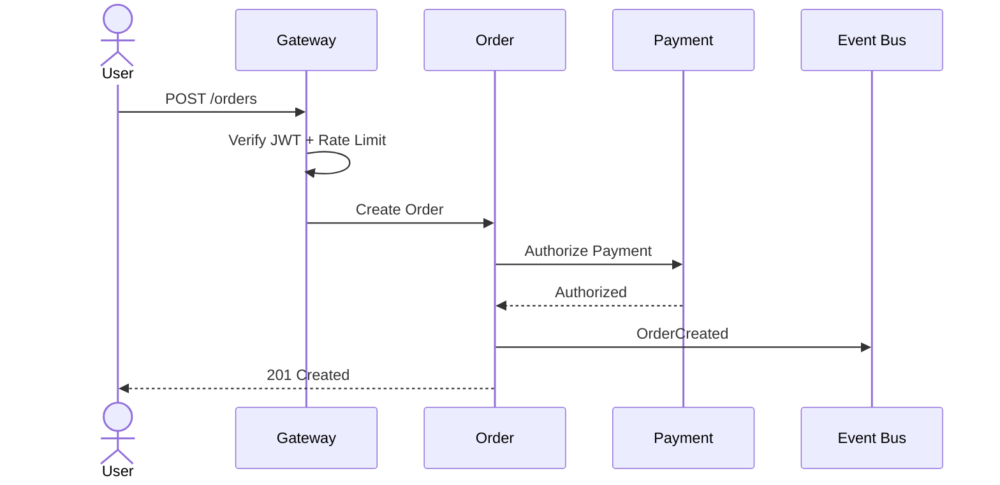

ARCHITECTURE / 2026

# Project Nova
## 從單體系統走向可演進的平台架構

  $ design --for scale --without chaos <i>_</i>

---
transition: slide-left
---

01 / CONTEXT

# 現有系統正在接近極限

  
<b>01</b><strong>部署耦合</strong>任何小改動都需重新部署整個系統

  
<b>02</b><strong>資料瓶頸</strong>單一資料庫承擔交易、分析與搜尋

  
<b>03</b><strong>故障擴散</strong>局部問題可能影響所有使用者

  
<b>04</b><strong>交付變慢</strong>團隊互相等待，無法獨立演進

---
transition: slide-up
---

02 / PRINCIPLES

# 四個架構原則

  
<i>◇</i><b>Domain First</b>依業務邊界拆分

  
<i>↯</i><b>Async by Default</b>事件驅動降低耦合

  
<i>◎</i><b>Observable</b>預設具備追蹤能力

  
<i>⌁</i><b>Secure by Design</b>身分就是新的邊界

---
transition: view-transition
---

03 / TARGET STATE

# 目標架構

  
WEBMOBILEPARTNERS

  
↓

  
API GATEWAY · AUTH · RATE LIMIT

  
↓

  

    IDENTITYCATALOGORDERBILLING
  

  
↓ EVENTS ↓

  
POSTGRES · REDIS · OBJECT STORAGE · SEARCH

---
transition: slide-left
---

04 / REQUEST FLOW

# 一次訂單，如何安全完成？

同步路徑保持最短，其餘工作透過事件非同步完成。

---
transition: slide-up
---

05 / RELIABILITY

# 失敗是預期，不是例外

  
<b>Timeout</b>每個外部呼叫都有時間上限

  
<b>Retry</b>指數退避與隨機抖動

  
<b>Circuit Breaker</b>停止放大下游故障

  
<b>Idempotency</b>重試不產生重複副作用

  
<b>Dead Letter</b>保留失敗事件供後續處理

  
<b>Tracing</b>跨服務追蹤每一次請求

---
transition: slide-left
---

06 / MIGRATION

# 不做 Big Bang Rewrite

  
<b>01</b><strong>建立平台層</strong>Gateway、觀測、部署基礎

  
<b>02</b><strong>抽離身分服務</strong>統一 AuthN / AuthZ

  
<b>03</b><strong>切分訂單領域</strong>Strangler Fig 漸進替換

  
<b>04</b><strong>資料所有權遷移</strong>停止跨領域直接查表

---
layout: center
transition: fade-out
---

DECISION

# 架構的目的不是變複雜， 而是讓改變保持簡單。

APPROVE PHASE 1 →

